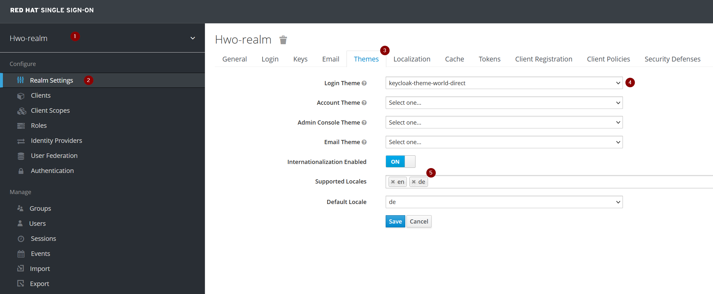

# Keycloak Theme World-Direct

This repo is based on the [Keycloakify v7 starter template](https://github.com/keycloakify/keycloakify-starter) and has been (minimally) adapted to serve the needs for <https://sso.world-direct.at>.

> Note: although stated in the [Standalone keycloak theme](https://github.com/keycloakify/keycloakify-starter#standalone-keycloak-theme) section, I did not perform said changes (except for the CI part) with the main reason being the ability to rebase more easily in future.

## Getting started

Is as simple as running:

```shell
yarn install && yarn storybook
```

and seeing live updates on your screen whenever you make edits.

### Important files

The upstream docs state[^0] that:
> [..] customizing the [Template.tsx](src/keycloak-theme/login/Template.tsx) component alone will already cover 90% of your customization needs.[^0]

Given this, the most important files are:

* [Template.tsx](src/keycloak-theme/login/Template.tsx)
* [KcApp.tsx](src/keycloak-theme/login/KcApp.tsx), for adding your own CSS `classes`
* [KcApp.css](src/keycloak-theme/login/KcApp.css), for defining your styles
* fiddling with resources

This repo's commits give good pointers, too.

## Deployment

* To create a new deployment, simply raise the version in [package.json](package.json); to create pre-release versions use the following versioning scheme: `0.1.2-rc.1`
* Push to the `main` branch, which in turn will automatically create a tag, generate the release notes, lint and build a `.jar` file containing the final theme
* Deploy the resulting jar file by either following the [Keycloak](https://www.keycloak.org/docs/latest/server_development/#deploying-themes) or [Red Hat SSO](https://access.redhat.com/documentation/en-us/red_hat_single_sign-on/7.6/html/server_developer_guide/themes#deploying_themes) docs.
  * tl;dr: copy the resulting jar file to a certain location, e.g., `${jboss.home}/standalone/deployments/`
  > Note: the latest version is **automatically picked up and deployed to <https://sso.world-direct.at>** when running the [ansible playbook](https://github.com/world-direct/redhatsso/) via `ansible-playbook site.yaml --tags keycloak_themes`

## Usages

To reference this theme, navigate to your realm > `Realm Settings` > `Themes` and choose `keycloak-theme-world-direct` as your `Login Theme`; *optionally* you can also enable `Internationalization Enabled` and set `de` as the `Default Locale`:



## Issues & Contributions

Feel free to raise an issue, contributions are welcome via PRs too :-).

## References

* [^0]: [Keycloakify Storybook](https://storybook.keycloakify.dev) shows all the base template provided out-of-the-box by Keycloak which can be overridden
* [1]: [Keycloakify Starter](https://github.com/keycloakify/keycloakify-starter#standalone-keycloak-theme) inluding its docs and its `Use this template` possibility
