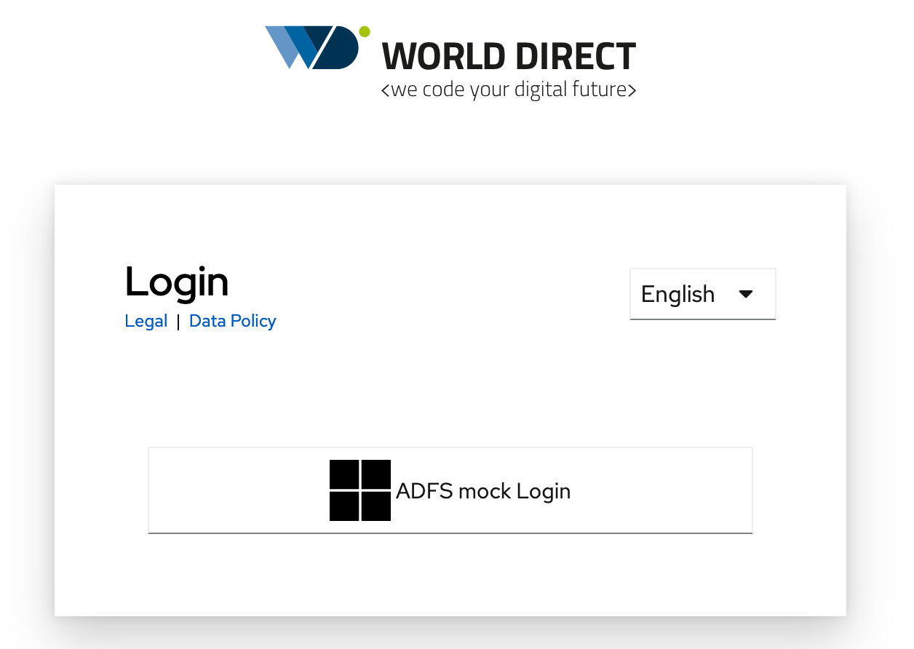
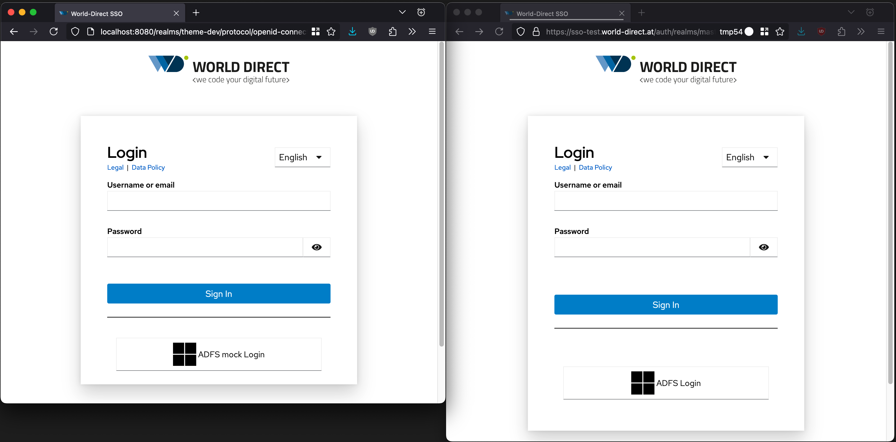

# Keycloak Theme World-Direct

> An opinionated, simple theme used as the `login` theme for World-Direct's RHBK instances.



The final jar version ships with two versions of this theme[^1]:

1. `keycloak-theme-world-direct-without-forms-login`: with the login form hidden as shown in the screenshot above
    * should the ADFS be down for whatever reason, form login (e.g. for the root user) is still possible via running `$("#kc-form-login").classList.remove('displayNone')` in the browser's console
2. `keycloak-theme-world-direct`: shows the usual login form, allowing a user/password to be entered; also features social providers

[^1]: created in the `Create two versions out of base theme` step in [ci.yaml](.github/workflows/ci.yaml#:24)

## Development

* Start keycloak, with theme caching disabled, and pre-created realms.

  Using podman:

  ```shell
  podman machine start
  podman compose up
  ```

  Using docker:

  ```shell
  docker compose up
  ```

* Next we need to set up a user which we can use for login purposes[^2]:
  navigate to <http://localhost:8080/admin/master/console/#/adfs-mock/users>, login via `admin`/`dev_only` and...
  * ... create a new user; for example: `Username`: `aaa` and hit `Save`
  * ... give this new user a password by navigating to the `Credentials` tab > `Set password` and set a password (e.g., Password/Password confirmation: `aaa`, Temporary: `Off`)
* For theme development, navigate to <http://localhost:8080/realms/theme-dev/account/>, by clicking on the `ADFS mock Login` button, you can use the previously set up user for logging in

[^2]: This step is required since users are not exported as part of the realm export json schema.

### Realm Details

The import will import two realms:

1. `theme-dev` realm is where all the theme-related development happens; moreover, it has a Identity Provider `adfs mock` configured which mocks an ADFS by setting up a trust towards the
2. `adfs-mock` realm: it serves solely for IdP users

## Deployment

* To create a new release, simply create a tag matching any of the naming schemas found in [Github action](.github/workflows/ci.yaml#L7), for example `v2.0.0`, `v2.0.1-beta1` etc. and push this tag to the remote
* This will create a [new release](https://github.com/world-direct/keycloak-theme-world-direct/releases) with `keycloak-theme-world-direct.jar` as an artifact

### Referencing the theme in Keycloak/RHBK

* Download the jar file and deploy it by either following the [Keycloak](https://www.keycloak.org/docs/latest/server_development/#deploying-themes) guide:
  > To deploy the archive to Keycloak, add it to the `providers/` directory of Keycloak and restart the server if it is already running. When you are working with production-optimized images, you might want to invoke `kc.sh build` prior to restarting Keycloak
* To reference this theme, navigate to your realm > `Realm Settings` > `Themes` and choose `keycloak-theme-world-direct` or `keycloak-theme-world-direct-without-forms-login` as your `Login Theme`; *optionally* you can also navigate to `Realm Settings` > `Localization` and enable `Internationalization` and set `Supported locales` to `German` and `English` w/ `German` as the `Default locale`.
* For production purposes open a PR by changing the corresponding version at <https://github.com/world-direct/rhbk/blob/main/src/ansible/group_vars/asp.yaml#L10>

### Caveats

* Keycloak/RHBK respects the operating system theme, so make sure to test dark and light mode of your theme
* For yet unknown reasons, the theme looks different when being run on RHBK vs. the locally run Keycloak instance: the `custom.css` served in production has only 88 lines (of the 99 lines expected), so there seems to be some optimization going on. Note the increased padding of the `Sign in` button as well as on the social provider buttons. For the time being, we simply live with this issue which is tracked in [\#21](https://github.com/world-direct/keycloak-theme-world-direct/issues/21).



## Issues & Contributions

Feel free to raise an issue, contributions are welcome via PRs too :-).

## References

* [1] [Red Hat build of Keycloak Server Developer guide \> Themes](https://docs.redhat.com/en/documentation/red_hat_build_of_keycloak/26.0/html-single/server_developer_guide/index#themes)
* [2] [Keycloak Server Developer guide \> Themes](https://www.keycloak.org/docs/latest/server_development/#_themes)
* [3] [World-Direct Theme guide](https://github.com/world-direct/rhbk/blob/main/docs/guides/themes.md)
